# MassTransit: Moving from Synchronous to Asynchronous Service Communication

## Overview

[MassTransit](https://masstransit-project.com/) is an open-source, distributed application framework for .NET which allows developers to easily create systems that leverage asynchronous, message-based communication patterns. At present it supports RabbitMQ, Azure Service Bus, SQS, and in-memory transports. In this first article, we will go over how to take an existing system that uses synchronous communication and migrate it to make use of asynchronous messaging by leveraging MassTransit. In subsequent articles we will build our system out to include more services and implement a saga by using MassTransit’s built in state machine support.

## Scenario

Video Palace is a small, independent video rental store in a town you’ve never heard of. Because no one rents videos anymore, the employees have found themselves with a lot of time on their hands and have decided to modernize the various systems used to support the eventual day when a customer does come to rent a video. The current systems Video Palace has in place are:

- Catalog
  - Contains the list of all movies Video Palace has and their associated metadata.
- Inventory
  - Contains Video Palace’s current video inventory including how many copies of each movie they own and how many are available for rent.
- Membership
  - Contains the list of all Video Palace member information and what movies they currently have rented out.
- Checkout
  - The system which processes member rentals and returns.

At present, Video Palace has created their Catalog and Inventory microservices. When a new movie is added to the Catalog, a REST call is made to the Inventory service to add the movie into the inventory with a default quantity of 1 copy. An additional REST call directly to the Inventory service can be used to increase or decrease the total copies of a video. In this article we will remove the tight coupling between the Catalog and Inventory services and introduce MassTransit to replace the synchronous REST call with asynchronous messaging.

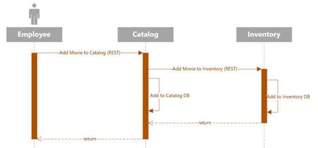

## Pre-Requisites

- .NET 7
- Docker
  - The infrastructure folder contains a docker-compose.yml file to spin up resources to support the Video Palace system.
- Visual Studio 2022 or Visual Studio Code
- Sample Code ([Video Palace Services (github.com)](https://github.com/seanmcgettrick/VideoPalace))
  - The main branch contains our starting point, the feature branch 01 will represent the state of the system at the end of this article.

## Running MongoDB

Begin by running docker-compose to start MongoDB from the **infrastructure** directory. If you do not want to make use of Docker to run MongoDB, you can skip this step, but you will have to modify the **MongoDbSettings** section in each service’s **appsettings.json** file if your Mongo instance is running anywhere besides localhost on port **27017**.

```powershell
cd infrastructure
docker-compose -f .\docker-compose.yml up -d
```

## Reviewing The Existing Solution

With the supporting infrastructure up and running, open the VideoPalace solution file in Visual Studio, or the top-level directory in VS Code. Note, for the remainder of this article we will be working in Visual Studio.

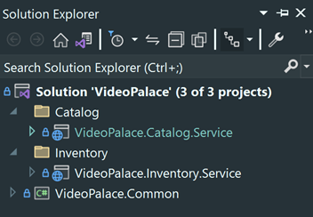 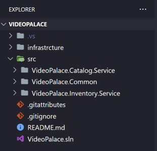

The first thing you will want to look at is the **launchSettings.json** file for each service project. Take note of the ports the services are running on. Feel free to change them if needed, but if you change the Inventory service’s port, you will also need to update the **InventoryServiceUrl** in the Catalog service’s app settings:

```json
{
  "Logging": {
    "LogLevel": {
      "Default": "Information",
      "Microsoft.AspNetCore": "Warning"
    }
  },
  "ServiceSettings": {
    "ServiceName": "Catalog"
  },
  "MongoDbSettings": {
    "Host": "localhost",
    "Port": 27017
  },
  "InventoryServiceUrl": "https://localhost:5010",
  "AllowedHosts": "*"
}
```

### Data Entities

Currently, each service contains one primary entity as well as some DTO records to facilitate communication between clients and services. In the Catalog service, the primary entity is **Movie**, and in the Inventory service the primary entity is **Video**. Both entities implement the **IEntity** interface:

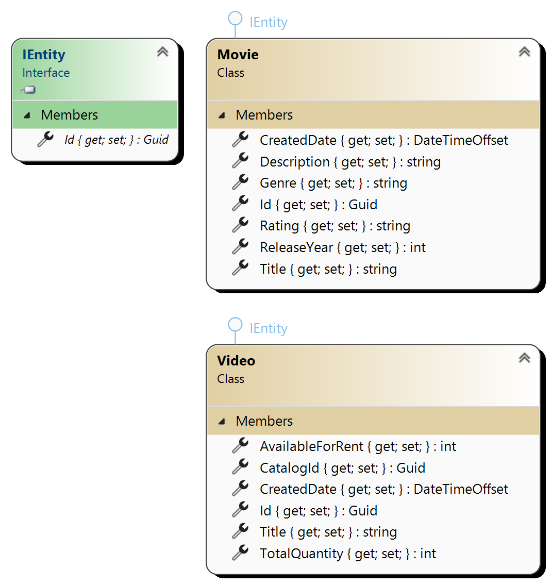

The Catalog service includes a data seed class called **SeedMovieCatalog** that will populate the **movies** collection if it is empty when the service starts. Movies can also be created via POST requests to the Catalog controller. Whether movies are created by the data seeder or the controller, a POST request is also sent to the Inventory controller to create a corresponding record in the **videos** collection. These requests are handled by the InventoryService class which builds the POST request and processes the response:

```csharp
public async Task<bool> AddMovieToInventoryAsync(Movie movie)
{
    var requestJson =
        $$"""
        {
            "catalogId": "{{movie.Id}}",
            "title": "{{movie.Title}}",
            "totalQuantity": 1
        }
        """ ;

    var request = new HttpRequestMessage(HttpMethod.Post, "videos")
    {
        Content = new StringContent(requestJson, Encoding.UTF8, "application/json")
    };

    var response = await _httpClient.SendAsync(request);

    return response.IsSuccessStatusCode;
}
```

### Running With Synchronous Processing

Start the solution and look at the console window for the Catalog service. You will see the REST calls the service makes to the Inventory service:

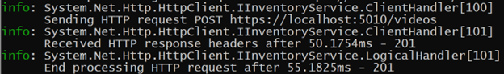

Check the collections in MongoDB to verify the movie and video records were created:

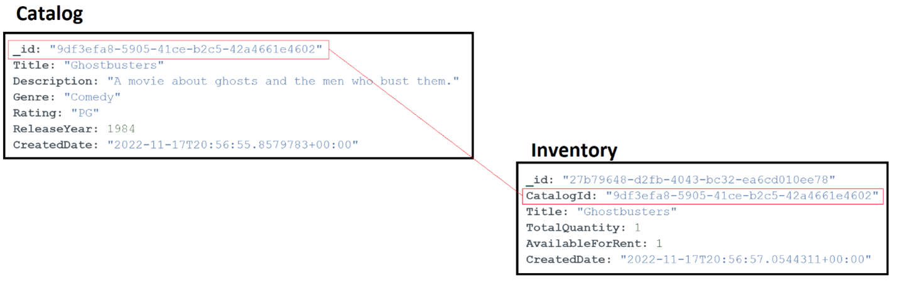

While there is nothing wrong with this solution, it introduces coupling between the services as the Catalog service is dependent on the Inventory service being up and able to successfully service a request and return a response. If the Inventory service goes down, the onus would be on the developers of the Catalog service to put in logic to handle retries and other fault scenarios. By introducing a messaging broker, the Catalog service can send messages that new items have been added, and the Inventory service can process those messages. If the Inventory service goes down or is unable to process the message in near-real-time due to heavy system load, the message broker will ensure the message is delivered once the service has returned to a healthy state.

## Introducing Asynchronous Messaging

As stated at the beginning of this article, MassTransit is a framework for developing applications that leverage message-based communication. It is not itself a message broker. For that we will turn to [RabbitMQ](https://www.rabbitmq.com/).

**The final source code for this article is available on Github [here](https://github.com/seanmcgettrick/VideoPalace/tree/01).**

### Standing Up RabbitMQ

If you do not have RabbitMQ already available, the easiest way to get it up and running is to add it to the Docker Compose file we ran earlier to stand up MongoDB:

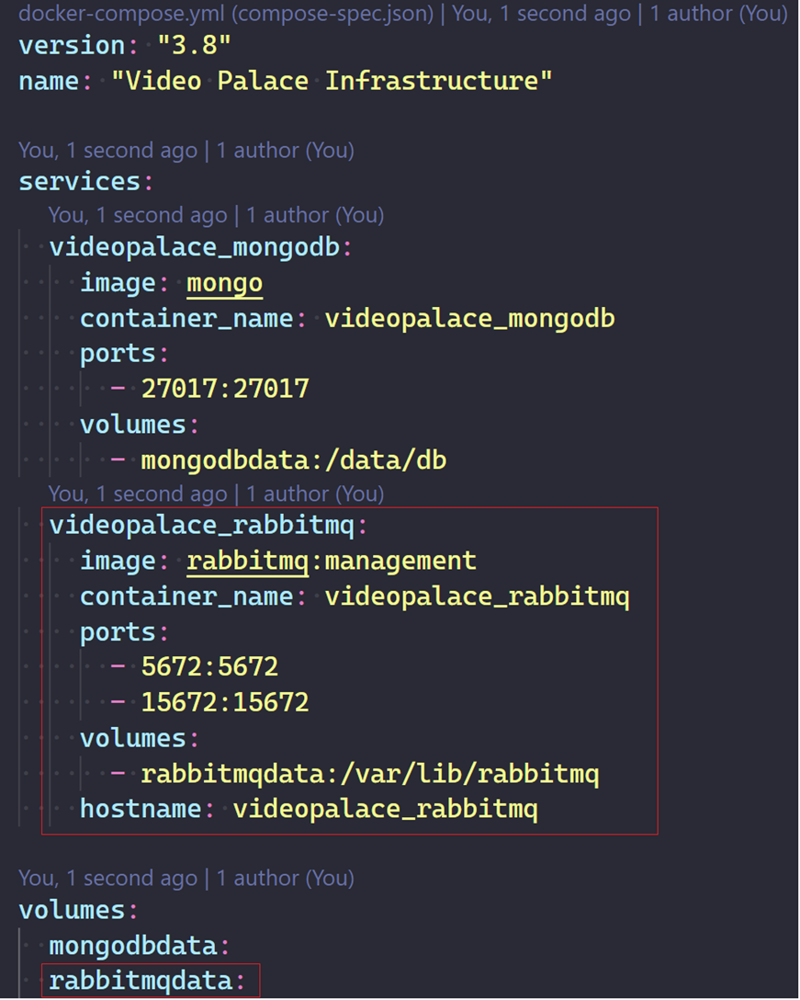

Running the same docker-compose command from the command line we used to spin up MongoDB will now also start RabbitMQ. You can verify the installation is running by going to [http://localhost:15672](http://localhost:15672). The default username and password for the RabbitMQ management console is **guest/guest**.

### Updating The Services

To prepare the services for communicating via RabbitMQ, there a few steps that need to be performed:

1. Add required MassTransit libraries to the Common library.
2. Add required configuration information to app settings and create the corresponding settings class in the Common library.
3. Create extension methods in the Common library to handle adding Mass Transit and configuring it to use RabbitMQ.
4. Create a new Catalog library to hold the events that will be sent to the Inventory service.
5. Create an event consumer in the Invetory project to process incoming messages.
6. Remove calls to the synchronous InventoryService class and replace with publishing messages to RabbitMQ

#### Add MassTransit Libraries

In the Common library project, add the following packages:

- MassTransit.AspNetCore
- MassTransit.RabbitMQ

#### Add Configuration Settings

In the **appSettings.json** file for each project, add the below section. You can also remove the **InventoryServiceUrl** setting from the Catalog project since we will not be using it anymore.

```json
  "RabbitMqSettings": {
    "Host": "localhost"
  },
```

Back in the Common project, create a new class in the Settings folder named RabbitMqSettings with the following code:

```csharp
public class RabbitMqSettings
{
    public string Host { get; init; } = default!;
}
```

#### Registering MassTransit and RabbitMQ

I am not going to paste the entirety of the code here, it can be obtained from GitHub [here](https://github.com/seanmcgettrick/VideoPalace/blob/01/src/VideoPalace.Common/Extensions/MassTransitExtensions.cs), but wanted to highlight a few things:

```csharp
config.AddConsumers(Assembly.GetEntryAssembly());
```

This line tells MassTransit to look for any classes that implement the **_IConsumer<T>_** interface and register them as message consumers. This is what we will implement in Step 5.

```csharp
config.Host(rabbitMqSettings!.Host);
config.ConfigureEndpoints(context, new KebabCaseEndpointNameFormatter(prefixName, false));
config.UseMessageRetry(rc => rc.Interval(3, TimeSpan.FromSeconds(5)));
```

The first line tells MassTransit where our RabbitMQ instance is running. The next line tells MassTransit how to format the queue and exchange names when they are created. This is another great thing about MassTransit as it takes care of configuring all of this for us and nothing has to be manually created in RabbitMQ. Finally, the last line sets a default retry policy. In our case, it is telling RabbitMQ to try to deliver the message three times, waiting five seconds between each attempt. This retry policy is configured at the message bus level, but further policies can be defined on a per-consumer basis giving you greater flexibiltiy in handling transient errors. To handle more serious, long lasting errors, message redelivery policies can be configured.

The last thing we need to do is go into the **Program.cs** file of each service and call the new extension method. Place this before the MongoDB registration:

```csharp
builder.Services.AddMassTransitRabbitMq(builder.Configuration, serviceSettings! ServiceName);
```

#### Create The Catalog Events Project

Create a new class library project named **VideoPalace.Catalog.Events**. In that project create a folder named **Outbound** and in it a new record named **CatalogMovieAdded**. Add the below code:

```csharp
public record CatalogMovieAdded(Guid CatalogId, string Title);
```

Add a new project reference in the Catalog and Inventory service projects to the Catalog events library:

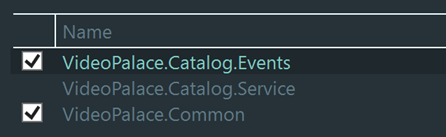

#### Create The Event Consumer

In the Inventory service project, create a folder named **Consumers** and a class named **CatalogMovieAddedConsumer**. Again, I will not paste the entirety of the code in this article, but it is available on GitHub [here](https://github.com/seanmcgettrick/VideoPalace/blob/01/src/VideoPalace.Inventory.Service/Consumers/CatalogMovieAddedConsumer.cs). The code should be self-explanatory. As mentioned earlier, the consumer will implement **IConsumer<T>** where T is of type **CatalogMovieAdded** from the new Catalog events library. The consumer will pull the Catalog Id and Title of the movie and then check to make sure it is not already in the Inventory database. If it is not, the consumer will create a new Video and add it to the database.

#### Remove Calls to The Inventory Service

Open the **CatalogController** class and replace the **IInventoryService** and replace with an **IPublishEndpoint** object. Also update the constructor accordingly:

```csharp
private readonly IPublishEndpoint _publishEndpoint;

public CatalogController(IRepository<Movie> movieRepository, IPublishEndpoint publishEndpoint)
{
    _movieRepository = movieRepository;
    _publishEndpoint = publishEndpoint;
}
```

Replace the call to **AddMovieToInventoryAsync** on Line 50 with a call to the new MassTransit IPublishEndpoint:

```csharp
await _publishEndpoint.Publish(new CatalogMovieAdded(movie.Id, movie.Title));
```

You will need to make similar updates in the **SeedMovieCatalog** class. On Line 19 replace the IInventoryService with an IPublishEndpoint:

```csharp
var publishEndpoint = scope.ServiceProvider.GetRequiredService<IPublishEndpoint>();
```

Finally on Line 63, replace the call to the service with a call to the publish endpoint that was just added:

```csharp
foreach (var movie in movies)
    await publishEndpoint.Publish(new CatalogMovieAdded(movie.Id, movie.Title), cancellationToken);
```

You can now safely delete the **Services** folder in the Catalog project and remove the service registration from Catalog's **Program.cs** file.

With that, it is now time to test the new messaging pattern, but first, let's examine how MassTransit handles configuring RabbitMQ for us.

### RabbitMQ Configuration

Instead of running the entire solution, start only the Inventory service project (making sure your Docker infrastructure is up and running first). If you look in your console output, you can see MassTransit's output:

```powershell
dbug: MassTransit[0]
      Bind queue: source: inventory-catalog-movie-added, destination: inventory-catalog-movie-added
dbug: MassTransit[0]
      Bind exchange: source: VideoPalace.Catalog.Events:CatalogMovieAdded, destination: inventory-catalog-movie-added
dbug: MassTransit.ReceiveTransport[0]
      Consumer Ok: rabbitmq://localhost/inventory-catalog-movie-added - amq.ctag-3dMsyEB7lAGtxYEDp3oyVA
dbug: MassTransit[0]
      Endpoint Ready: rabbitmq://localhost/inventory-catalog-movie-added
info: MassTransit[0]
      Bus started: rabbitmq://localhost/
```

MassTransit picked up on the CatalogMovieAddedConsumer class we created and automagically created the RabbitMQ exchange and queue bindings. If you read the output closely, or look in the RabbitMQ Management Console, you'll notice that two exchanges were actually created. [This StackExchange answer](https://stackoverflow.com/a/73856340) explains the reasoning behind this behavior if you want to dive into it deeper, but for now, we have our exchanges and queues created and properly configured without having to touch RabbitMQ directly.

### Running The Catalog Service

Before running the Catalog service, go into MongoDB and either drop both the Catalog and Inventory databases, or the collections in each database so we are starting with a clean slate. Once this is done, start the Catalog Service. Looking at the output, we can see that again, MassTransit knows which exchange we want to publish our messages to based upon the **CatalogMovieAdded** contract we created that is also used by the consumer in the Inventory service. We can also see our three messages published, one for each movie created:

```powershell
dbug: MassTransit[0]
      Declare exchange: name: VideoPalace.Catalog.Events:CatalogMovieAdded, type: fanout, durable
dbug: MassTransit.Messages[0]
      SEND rabbitmq://localhost/VideoPalace.Catalog.Events:CatalogMovieAdded 20490000-5dee-0015-dda5-08dad861b900 VideoPalace.Catalog.Events.CatalogMovieAdded
dbug: MassTransit.Messages[0]
      SEND rabbitmq://localhost/VideoPalace.Catalog.Events:CatalogMovieAdded 20490000-5dee-0015-2811-08dad861b911 VideoPalace.Catalog.Events.CatalogMovieAdded
dbug: MassTransit.Messages[0]
      SEND rabbitmq://localhost/VideoPalace.Catalog.Events:CatalogMovieAdded 20490000-5dee-0015-cebc-08dad861b911 VideoPalace.Catalog.Events.CatalogMovieAdded
```

And on the receiving end:

```powershell
dbug: MassTransit.Messages[0]
      RECEIVE rabbitmq://localhost/inventory-catalog-movie-added 20490000-5dee-0015-dda5-08dad861b900 VideoPalace.Catalog.Events.CatalogMovieAdded VideoPalace.Inventory.Service.Consumers.CatalogMovieAddedConsumer(00:00:00.6105787)
dbug: MassTransit.Messages[0]
      RECEIVE rabbitmq://localhost/inventory-catalog-movie-added 20490000-5dee-0015-2811-08dad861b911 VideoPalace.Catalog.Events.CatalogMovieAdded VideoPalace.Inventory.Service.Consumers.CatalogMovieAddedConsumer(00:00:00.6105774)
dbug: MassTransit.Messages[0]
      RECEIVE rabbitmq://localhost/inventory-catalog-movie-added 20490000-5dee-0015-cebc-08dad861b911 VideoPalace.Catalog.Events.CatalogMovieAdded VideoPalace.Inventory.Service.Consumers.CatalogMovieAddedConsumer(00:00:00.6105773)
```

Checking back in MongoDB:

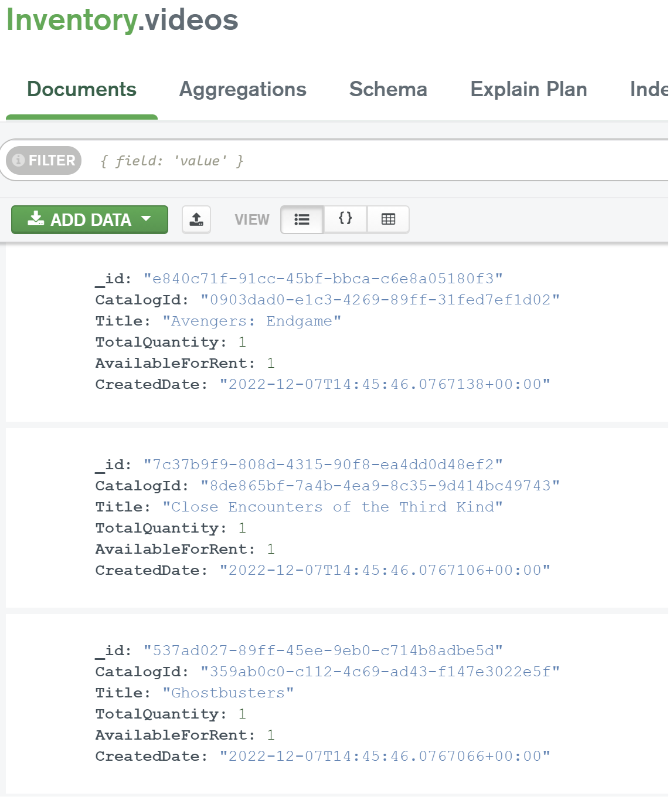

Great Success! Our two services are now communicating asynchroniously via RabbitMQ. So what would happen if the Inventory service had been offline when the Catalog service started up? In the old, synchronous model, we would have received errors when the connection to the Inventory service timed out. In our new model, the Catalog service will publish its messages and go on with its day. RabbitMQ will hold the messages until the Inventory services comes online and then deliver them. You can test this out by once again clearing out the data in MongoDB, and starting only the Catalog service.

Looking at the output we see the messages being published, and in RabbitMQ you can see them sitting in the queue:

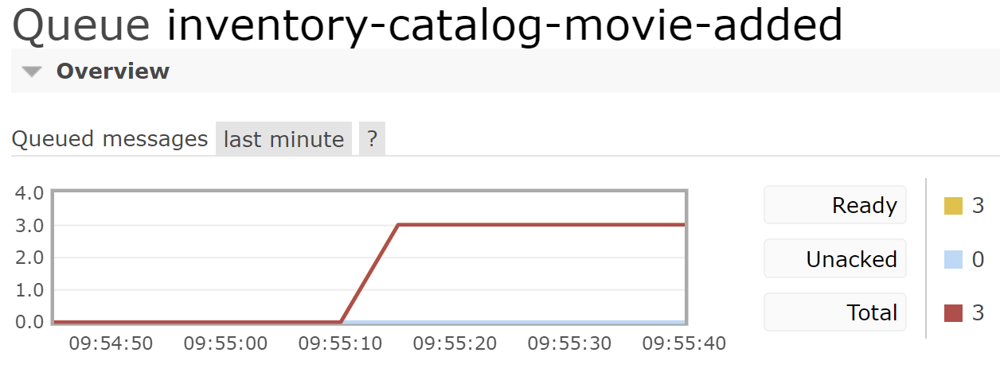

Now start up the Inventory service. You'll see the messages being received as soon as the service starts, and the queue is now empty:

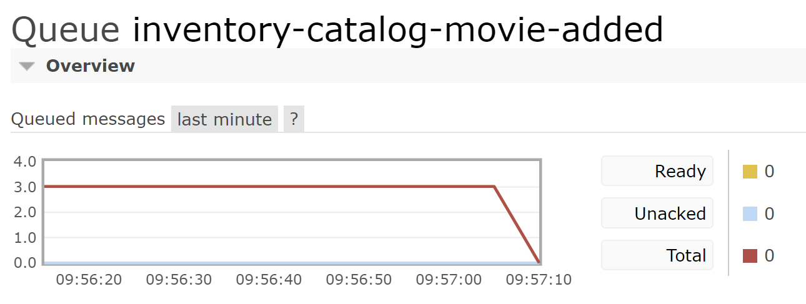

## Summary

With the move to asynchronous messaging, Video Palace employees can now safely add new movies to their catalog and not have to worry about adding them into their rental inventory if the service happens to go offline or suffers any other sort of interruption. This was made possible by moving to an asynchronous messaging communication pattern which MassTransit made pain-free to implement.

In the next article, we will take a biref segue to show how MassTransit easily allows you to switch between RabbitMQ locally and Azure Service Bus when deployed to the cloud. After that we'll implement the remaining services and introduce a Saga pattern to handle the rental process.
